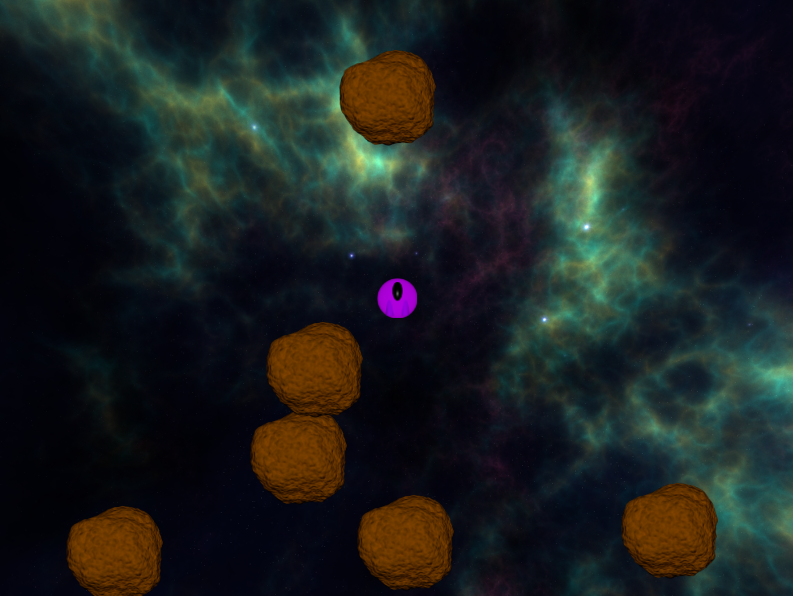

# Asteroid Clash

<!--  -->

I recreated the classic game Asteroid using Pygame and OOPs concept in python

## Screnshot

## Controls

- `RIGHT` to rotate the clockwise
- `LEFT` to rotate the anti-clockwise
- `UP` to accelerate the ship
- `SPACE` to shoot bullets

## About me

Feel free to leave your feedback, additional features, erros or any general comments at **preetparmar@outlook.com**

Check out my [website](https://preetparmar.com/) and the blog post related to this game [here](https://blog.preetparmar.com/index.php/2021/11/14/asteroid-clash-a-python-game-made-with-pygame-and-oops/)
