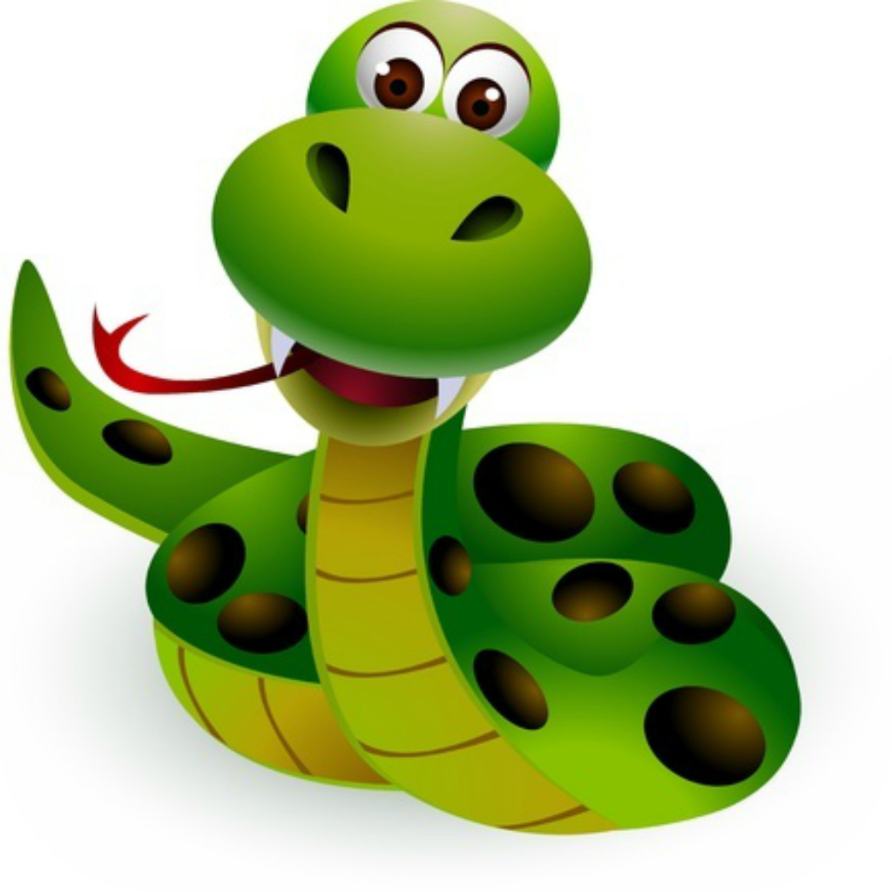

# Welcome to my Snake Game 
Being a 90s kid this game is very close to my heart, which is the same for all the 90s generation out there.

I wanted to make this game my own and in process widen my skill and knowledge about python modules.

The purpose of this project is to:
- Put the first step into gaming with python
- Familiarize myself with PyGame Python Module
- Look at various Events in PyGame
- Understand and Implement the complex logic behind the simple looking game

Some notes:
- The two fonts which I have used are saved in fonts folder and am using variables for the folder path.
    - If you wish to use your own fonts then save them and update the variables.
- There are some scenarios which I know needs work on:
    - User can move in the opposite direction, for example the user can go up while it's going down and this causes the game to be over
    - Apple spawns on the snake list
    - Change the speed of the snake as time progresses
- Some additional "Nice to have" features I am working on:
    - Develop a 2nd version on the game where the snake goes out of the boundary and appears on the opposite side.

Feel free to leave your feedback, additional features, erros or any general comments at **preetparmar@outlook.com**

<!-- Check out my portfolio [here](https://preetparmar.github.io/ "My Portfolio") -->
